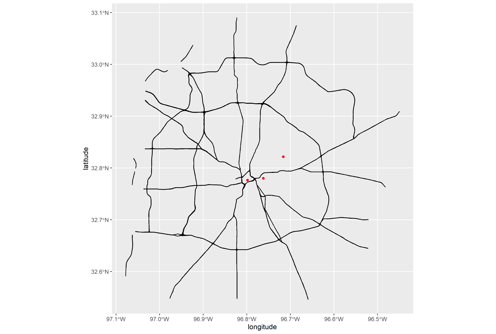

DallasGeocodeR is an R package for interfacing with the City of Dallas's [public
geocoding services](https://gis.dallascityhall.com/wwwgis/rest/services/ToolServices),
a set of REST APIs powered by ArcGIS. The DallasGeocodeR package
provides convenient wrapper functions for several key operations:

- [geocodeAddresses](https://developers.arcgis.com/rest/geocode/api-reference/geocoding-geocode-addresses.htm) -
For calculating geographic coordinates (latitude/longitude) from street
addresses or intersections
- [reverseGeocode](https://developers.arcgis.com/rest/geocode/api-reference/geocoding-reverse-geocode.htm) -
For the opposite operation: determining street addresses or intersections from
latitude and longitude coordinates
- [findAddressCandidates](https://developers.arcgis.com/rest/geocode/api-reference/geocoding-find-address-candidates.htm) -
For finding probable addresses and lat/long coordinates for a given location

```{r, include = FALSE}
knitr::opts_chunk$set(
  collapse = TRUE,
  comment = "#>"
)

devtools::load_all()
```

To get started, first install the package via `remotes`, then simply load in
the library.

```{r install, eval = F}
# install.packages("remotes")
remotes::install_github("log-linear/DallasGeocodeR")

library(DallasGeocodeR)
```
```{r setup, echo = F}
library(DallasGeocodeR)
```
## Usage

### Geocoding addresses

Let's begin by creating some sample addresses.

```{r}
addresses <- data.frame(
  street = c('8525 Garland Rd', '1500 Marilla St', '3809 Grand Avenue'),
  city = c('Dallas', 'Dallas', 'Dallas'),
  zip = c('75218', '75201', '75210')
)
addresses
```

From here, geocoding addresses is a simple function call:

```{r}
coords <- geocode_addresses(addresses$street, addresses$city, addresses$zip)
print(coords)
```

The function does not actually need the `city` and `zip` parameters to run.
ArcGIS's API can also geocode using just street addresses.

```{r}
geocode_addresses(addresses$street)
```

Note the `#> [1] "Processing batch 1 of 1"` line in both of the above examples.
ArcGIS's geocoding API can only process 1000 addresses in a single request. When
attempting to geocode more than 1000 addresses, the `geocode_addresses` function
breaks up the address list into batches of 1000, submitting requests to the API
for each batch one at a time.

#### Example usage: mapping out geocoded addresses

The API is generally very accurate. Here we use the `esri2sf` package to connect
to the City of Dallas's DallasAreaRoads FeatureServer, which we will use in
combination with `ggplot2` to plot our geocoded addresses onto a map of the
city's major highways.

```{r eval = F}
# remotes::install_github("yonghah/esri2sf"
library(esri2sf)
library(ggplot2)

url <- "https://services2.arcgis.com/rwnOSbfKSwyTBcwN/ArcGIS/rest/services/DallasAreaRoads/FeatureServer/0"
dallas <- esri2sf(url)
#> [1] "Feature Layer"
#> [1] "esriGeometryPolyline"
#> [1] "Coordinate Reference System: 2276"

ggplot() +
  geom_sf(data = dallas) +  # Dallas map layer
  geom_point(data = coords,  # Overlay geocoded coordinates
             mapping = aes(x = longitude, y = latitude),
             color = "red") +
  coord_sf()
```
{width=99%}

### Reverse geocoding lat/long coordinates

Using the `reverse_geocode` function, the API can find addresses from a given
set of coordinates

```{r}
reverse_geocode(coords$latitude, coords$longitude)
```

### Finding address candidates

The `find_address_candidates` function takes in a single address as input and
returns a list of matching City of Dallas addresses.

```{r}
find_address_candidates(addresses$street)
```